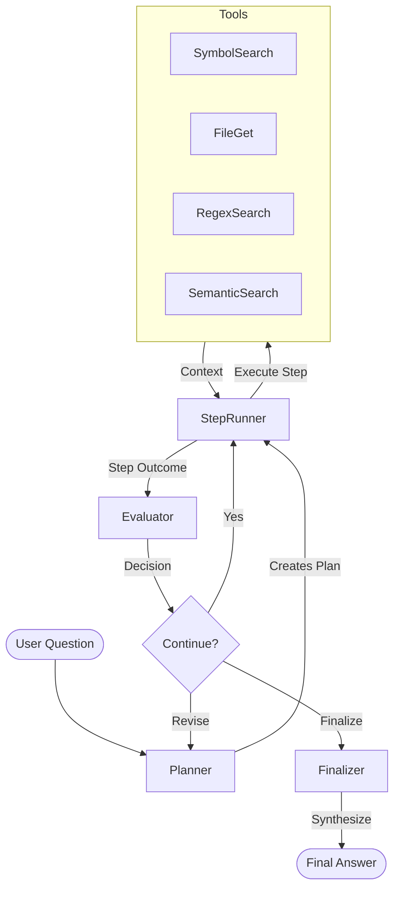

# Guidewire Gosu RAG Agent Tooling

**Vector-DB-agnostic RAG agent system for querying Guidewire Gosu codebases**

[](https://www.typescriptlang.org/)
[-green.svg)](https://nodejs.org/)
[](https://www.trychroma.com/)

---

## 📋 Overview

This project provides intelligent RAG (Retrieval-Augmented Generation) agent tooling for analyzing Guidewire Gosu codebases. It **consumes** the indexed artifacts from [gosu-rag](https://github.com/ashan/gosu-rag) and provides an AI-powered query interface with:

- ✅ **Structured Planning**: Breaks complex questions into actionable steps
- ✅ **Tool-Based Retrieval**: Symbol search, file retrieval, regex patterns, semantic search
- ✅ **Grounded Responses**: Cites exact file paths and line numbers
- ✅ **Anti-Hallucination**: Only references code that tools have retrieved
- ✅ **Multi-Collection Support**: Query across multiple Chroma collections simultaneously
- ✅ **Provider-Agnostic**: Pluggable LLM providers (OpenAI, Anthropic, Azure OpenAI)

---

## 🏗️ Architecture

### System Flow



### Key Components

- **Planner**: Converts user query → structured plan (LLM + Zod validation)
- **Step Runner**: Executes plan steps, makes tool calls (single tool call per turn)
- **Evaluator**: Assesses progress, decides next action
- **Finalizer**: Synthesizes comprehensive answer
- **Tools**: 4 core tools for code retrieval
- **Vector Store**: ChromaDB adapter (multi-collection support)
- **LLM Providers**: OpenAI (primary), Anthropic (secondary)

---

## 🚀 Quick Start
 
 ### Prerequisites
 
 - **Node.js**: v20 (LTS) - Required for native module compatibility (tree-sitter)
 - **Docker**: For running ChromaDB
 - **Sibling Projects**: `gosu-chroma-rag` and `chroma-rag-docs` checked out in the same parent directory
 - **API Keys**: Google Gemini API Key (or OpenAI/Anthropic)
 
 ### Installation
 
 ```bash
 # Clone core projects into the same directory
 git clone <repo>/gosu-chroma-rag-context
 git clone <repo>/gosu-chroma-rag
 git clone <repo>/chroma-rag-docs
 
 cd gosu-chroma-rag-context
 
 # Install dependencies
 npm install
 
 # Install sibling dependencies (Important for fresh clones)
 npm run fix:deps
 
 # Copy environment template
 cp .env.example .env
 
 # Edit .env with your configuration
 # Set GOOGLE_API_KEY
 nano .env
 ```
 
 ### Infrastructure
 
 Start the shared ChromaDB instance:
 
 ```bash
 docker compose up -d
 ```
 
 ### Ingestion
 
 Ingest code and documentation using the unified CLI:
 
 ```bash
 # Ingest Gosu Code
 npm run ingest:code
 
 # Ingest PDF Documentation
 npm run ingest:docs
 
 # Ingest Both
 npm run ingest:all
 ```
 
 ### Query
 
 Query the consolidated knowledge base (Code + Docs):
 
 ```bash
 npm run query "How does account validation work?"
 ```
 
 ### Statistics
 
 View collection statistics:
 
 ```bash
 npm run stats
 ```
 
 ---
 
 ## 🔧 Configuration
 
 ### Environment Variables
 
 | Variable | Description | Default |
 |----------|-------------|---------|
 | `PROVIDER` | LLM provider (`google` \| `openai` \| `anthropic`) | `google` |
 | `MODEL` | Model identifier (e.g., `gemini-1.5-flash`) | `gemini-1.5-flash` |
 | `EMBEDDING_PROVIDER` | Embedding provider (`google` \| `openai`) | `google` |
 | `GOOGLE_API_KEY` | Google API key | Required |
 | `CHROMA_HOST` | ChromaDB host | `localhost` |
 | `CHROMA_PORT` | ChromaDB port | `8000` |
 | `CODE_COLLECTION` | Code collection name | `guidewire-code` |
 | `DOCS_COLLECTION` | Docs collection name | `guidewire-docs` |


### Run a Query
 
 ```bash
 # Fast query (recommended - mostly bypasses build)
 npm run query "How does account validation work?"
 
 # Development mode
 npm run dev "How does account validation work?"
 
 # Production mode (compiled)
 npm run build
 npm run start "How does account validation work?"
 ```

---

## 🔧 Configuration

### Environment Variables

| Variable | Description | Default |
|----------|-------------|---------|
| `PROVIDER` | LLM provider (`openai` \| `anthropic` \| `azure_openai`) | `openai` |
| `MODEL` | Model identifier (e.g., `gpt-4o-mini`) | Required |
| `TOOL_FORMAT` | Tool schema format (`openai` \| `anthropic`) | `openai` |
| `OPENAI_API_KEY` | OpenAI API key | Required if using OpenAI |
| `CHROMA_HOST` | ChromaDB host | `localhost` |
| `CHROMA_PORT` | ChromaDB port | `8000` |
| `CHROMA_COLLECTIONS` | Collections to query (comma-separated) | `guidewire-code` |
| `MAX_TURNS` | Max tool calls per step | `10` |
| `TOP_K` | Default semantic search results | `6` |
| `LOG_LEVEL` | Logging verbosity (`error`\|`warn`\|`info`\|`debug`\|`trace`) | `info` |
| `AGENT_SYSTEM_PROMPT_PATH` | Path to agent system prompt markdown file | `./AGENT_SYSTEM_PROMPT.md` |

### Multi-Collection Setup

To query multiple collections:

```bash
CHROMA_COLLECTIONS=guidewire-code,templates,external-libs
```

The system will:
1. Query all collections simultaneously
2. Merge and rank results
3. Include collection name in results

---

## 🛠️ Available Tools

The agent has access to 8 powerful retrieval tools:

### Vector Store Tools (for Gosu code)

#### 1. `symbol_search(query, filePaths?)`
Find code by symbol/class/function name.

```typescript
symbol_search("AccountEnhancement_ACC")
symbol_search("validatePrimaryAddress", ["nz/co/acc"])
```

#### 2. `get_file(filePath)`
Retrieve complete file contents from vector store.

```typescript
get_file("nz/co/acc/account/Account.gs")
```

#### 3. `regex_search(pattern, filePaths?)`
Find code matching regex patterns.

```typescript
regex_search("gw\\.api\\.database\\.Query")
regex_search("@Override.*validate")
```

#### 4. `semantic_search(query, topK?, filter?)`
Embedding-based similarity search.

```typescript
semantic_search("account validation logic", 10)
semantic_search("database query", 5, { chunkType: "function" })
```

### Documentation Search

#### 5. `guidewire_docs_search(query, topK?, category?)`
Search official Guidewire PDF documentation.

```typescript
guidewire_docs_search("contact manager configuration")
guidewire_docs_search("billing integration", 10)
```

### File System Tools (for XML, XSD, YAML configs)

These tools access files directly from `SOURCE_ROOT_PATH` (not in vector store).

#### 6. `find_source_files(pattern, maxResults?)`
Find files by glob pattern.

```typescript
find_source_files("**/*.xml")
find_source_files("**/messaging*.yaml", 20)
```

#### 7. `list_source_directory(path?, pattern?)`
Browse directory contents.

```typescript
list_source_directory("config")
list_source_directory("integration", "*.yaml")
```

#### 8. `read_source_file(path)`
Read file contents by relative path.

```typescript
read_source_file("config/messaging-config.xml")
```

## 📝 Agent System Prompt

The agent's behavior is defined by an **external markdown file** (`AGENT_SYSTEM_PROMPT.md`) that:

- Defines the agent's identity and constraints
- Describes available tools in detail
- Establishes anti-hallucination rules
- Provides response format guidelines
- Sets citation requirements

### Template Variables

The prompt supports dynamic substitution:
- `{{COLLECTIONS}}` - Collection names from .env
- `{{METADATA_FIELDS}}` - Available metadata fields
- `{{TOP_K}}` - Default top-K value
- `{{MAX_TURNS}}` -Maximum tool calls per step

### Customization

To use a custom prompt:

```bash
# .env
AGENT_SYSTEM_PROMPT_PATH=./prompts/custom-agent.md
```

---

## 🧪 Example Queries

### Simple Queries

```bash
npm run start "What is the AccountEnhancement class?"
npm run start "Show me the validatePrimaryAddress function"
npm run start "Find all uses of gw.api.database.Query"
```

### Complex Queries

```bash
npm run start "How does account validation work in the ACC project?"
npm run start "What enhancements exist for the Account entity?"
npm run start "Show me how policy location is validated"
```

### Exploratory Queries

```bash
npm run start "What database query utilities are available?"
npm run start "Find examples of custom validations"
npm run start "How is the billing system plugin implemented?"
```

---

## 🏗️ Project Structure

```
gosu-chroma-rag-context/
├── src/
│   ├── config/               # Configuration & prompts
│   │   ├── env.ts           # Environment variable loading
│   │   ├── prompts.ts       # Default prompts
│   │   └── agentPrompt.ts   # External prompt loader
│   ├── planning/            # Planning schemas
│   │   ├── schemas.ts       # Zod schemas (Plan, StepOutcome, etc.)
│   │   └── planner.ts       # Plan generation
│   ├── runtime/             # Agent runtime
│   │   ├── agent.ts         # Main orchestrator
│   │   ├── stepRunner.ts    # Step execution with tools
│   │   ├── evaluator.ts     # Plan evaluation
│   │   └── finalizer.ts     # Answer synthesis
│   ├── tools/               # Tool system
│   │   ├── Tool.ts          # Base tool interface
│   │   ├── registry.ts      # Tool registry
│   │   ├── adapters/        # Format adapters (OpenAI, Anthropic)
│   │   └── implementations/ # 4 core tools
│   ├── vectorstores/        # Vector store adapters
│   │   ├── VectorStoreAdapter.ts
│   │   └── chroma/          # ChromaDB implementation
│   ├── providers/           # LLM providers
│   │   └── buildLLM.ts      # OpenAI client
│   ├── utils/               # Utilities
│   │   ├── messages.ts      # Message construction
│   │   └── errors.ts        # Error handling
│   └── main.ts              # CLI entry point
├── AGENT_SYSTEM_PROMPT.md   # Agent behavior definition
├── .env.example             # Configuration template
├── package.json
├── tsconfig.json
└── README.md
```

---

## 🔌 Extending the System

### Adding a New Tool

1. Create tool implementation in `src/tools/implementations/`
2. Extend BaseTool class
3. Define Zod schema for parameters
4. Implement `execute()` and `toToolSpec()` methods
5. Register in `src/tools/registry.ts`

Example:

```typescript
import { z } from 'zod';
import { BaseTool } from '../Tool.js';

const MyToolParamsSchema = z.object({
  param1: z.string(),
});

export class MyTool extends BaseTool {
  readonly name = 'my_tool';
  readonly description = 'What this tool does';
  readonly parameters = MyToolParamsSchema;

  async execute(args, ctx) {
    // Implementation
    return result;
  }

  toToolSpec(format) {
    // Generate OpenAI or Anthropic format
  }
}
```

### Adding a New Vector Store

1. Implement `VectorStoreAdapter` interface
2. Create adapter in `src/vectorstores/`
3. Update `.env` configuration
4. Update main.ts to instantiate new adapter

---

## 🐛 Troubleshooting

### ChromaDB Connection Failed

```bash
# Check if ChromaDB is running
docker ps | grep chroma

# Start ChromaDB (from gosu-rag project)
cd ../gosu-chroma-rag
docker compose up -d
```

### No Results from Tools

- Verify collection name matches gosu-rag: `CHROMA_COLLECTIONS=guidewire-code`
- Check that ingestion completed successfully in gosu-rag
- Inspect collection: `cd ../gosu-rag && npm run inspect-chroma`

### OpenAI API Errors

- Verify API key is correct
- Check API rate limits
- Ensure model name is valid (e.g., `gpt-4o-mini`)

### TypeScript Errors

```bash
# Clean and rebuild
npm run clean
npm run build
```

---

## 📊 Performance

- **Typical Query**: 10-30 seconds depending on complexity
- **Multi-Step Queries**: 30-60 seconds
- **Tool Calls**: 1-3 seconds per tool
- **LLM Latency**: 2-5 seconds per LLM call

---

## 🔒 Security

- API keys stored in `.env` (never committed)
- Read-only access to vector store
- No code modification capabilities
- All queries logged (configurable)

---

## 📄 License

MIT License - see LICENSE file for details

---

## 🤝 Contributing

1. Fork the repository
2. Create a feature branch
3. Make your changes
4. Add tests if applicable
5. Submit a pull request

---

## 🙏 Acknowledgments

- [gosu-rag](https://github.com/ashan/gosu-rag) - Codebase ingestion pipeline
- [ChromaDB](https://www.trychroma.com/) - Vector database
- [OpenAI](https://openai.com/) - LLM provider
- [Zod](https://zod.dev/) - TypeScript-first schema validation

---

**Built with ❤️ for intelligent Guidewire codebase analysis**
